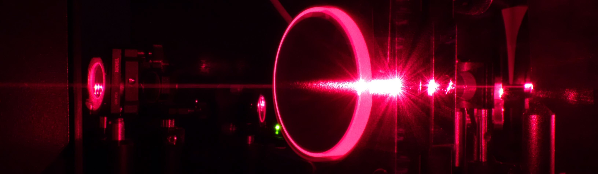

  

  <h1>Welcome to "optical control of brain functioning with optogenetics and wavefront engineering"</h1>
  <h2>This school will be held at Institut de la Vision, 17 rue Moreau, 75012 Paris</h2>
  <h2>From Monday 10 to Wednesday 19 March 2025</h2>
  
The official website is currently down and will be back online shortly.
 
  
We will keep you updated on its reopening and provide the corresponding URL.

  
In the meantime, you can register by emailing the organizing committee directly.

  
The registration fee is 2700&euro;.

  <a href="assets/program_2025_F.pdf" class="download-link">Program of the school</a>
  
<b>organizing committee :</b> 
	<ul>
	<li><a href="mailto:valentina.emiliani@inserm.fr">Valentina Emiliani</a></li>  
	<li><a href="mailto:Eirini.papagiakoumou@inserm.fr">Eirini Papagiakoumou</a></li>  
	</ul> 
  

